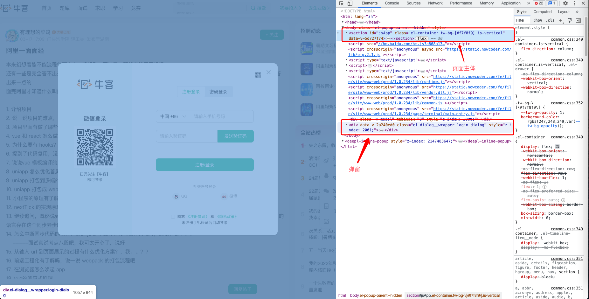

## BodyMask

遮罩层组件

这么说可能会有点难以理解，举个例子：我们在写弹窗内容时，我们希望将弹窗组件挂载到最外层的容器中，即和 .root 一个层级；即要达到类似于这种效果

本组件主要是实现了这样一层壳，方便各种场景 dialog 的调用

## 原理

BodyMask 的原理其实就是 ReactDOM.createPortal 这个 API

## demo

<code src="./demo/BodyMask/demo1.tsx"></code>

## API

<API id="BodyMask"></API>
