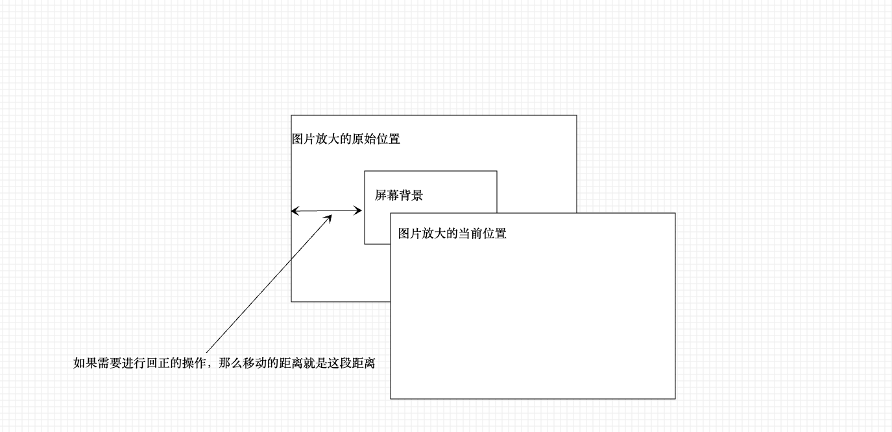

## ImageCheck

图片查看组件
该组件基于 [NonameGesture 手势库](https://github.com/18223781723/noname-gesture) 实现了图片查看的功能，支持如下功能：

1. 图片双指放大和双指缩小(移动端)
2. 图片双指旋转
3. 双击放大和双击回正
4. 图片拖动
5. 滑轮放大缩小
6. 图片边界条件的回正(这个手势库不支持，需要自己手动实现**这种逻辑属于业务的定制逻辑，不在手势库中实现是正确的！**)

由上述功能简介可知，这个图片查看组件可以被用于 web 和移动端中，因为手势库兼容这两个场景的相关事件

**这里强烈推荐使用 NonameGesture 手势库！**

## demo

<code src="./demo/ImageCheck/demo1.tsx"></code>

## API

<API id="ImageCheck"></API>

## 图片边界跳转回正

图片的回正只要是以来下面这段代码：
它的核心原理是当拖拽图片时，发现图片存在以下的逻辑：

1. 图片 scale > 1 时，图片左边/右边存在黑边
2. 图片 scale < 1 时，图片左边/右边处于屏幕之外
   那么触发回正逻辑

```
pointerup: function (e) {
  const { x, y, scale, imgWidth, initialX, initialY } =
    $imgInfo.current;
  // 如果图片处于正常大小的话，那么此时回正图片
  if (scale === 1) {
    setImgInfo('x', initialX);
    setImgInfo('y', initialY);
    setImgStyle(400);
    setLogHTML();
    return;
  }
  let xTemp = x;
  let yTemp = y;
  const obj = ($Img.current as HTMLElement).getBoundingClientRect();
  if (obj.width >= window.innerWidth) {
    // 图片宽度 >= 屏幕宽度
    if (obj.right < window.innerWidth) {
      // 图片最右边存在黑边时
      xTemp += window.innerWidth - obj.right;
    } else if (obj.left > 0) {
      // 图片左边存在黑边的情况
      // 如果这个算法没有看懂，那么看下面的辅助图片
      xTemp = (imgWidth * scale) / 2 - imgWidth / 2;
    }
  } else {
    // 图片的宽度 < 屏幕的宽度
    if (obj.right > window.innerWidth) {
      // 图片右边处于屏幕之外
      xTemp -= obj.right - window.innerWidth;
    } else if (obj.left < 0) {
      // 图片左边处于屏幕之外
      xTemp = (imgWidth * scale) / 2 - imgWidth / 2;
    }
  }

  if (obj.height >= window.innerHeight) {
    // 图片的高度 >= 屏幕的高度
    if (obj.top > 0) {
      // 图片的上部存在黑边
      yTemp -= obj.top;
    } else if (obj.bottom < window.innerHeight) {
      // 图片的下部存在黑边
      yTemp += window.innerHeight - obj.bottom;
    }
  } else {
    // 图片的高度 <= 屏幕的高度
    if (obj.top < 0) {
      // 图片上边位于屏幕之外
      yTemp += -1 * obj.top;
    } else if (obj.bottom > window.innerHeight) {
      // 图片的下边位于屏幕之外
      yTemp -= obj.bottom - window.innerHeight;
    }
  }

  setImgInfo('x', xTemp);
  setImgInfo('y', yTemp);
  setImgStyle(400);
  setLogHTML();
}
```



# 参考链接

1. [NonameGesture](https://github.com/18223781723/noname-gesture)
